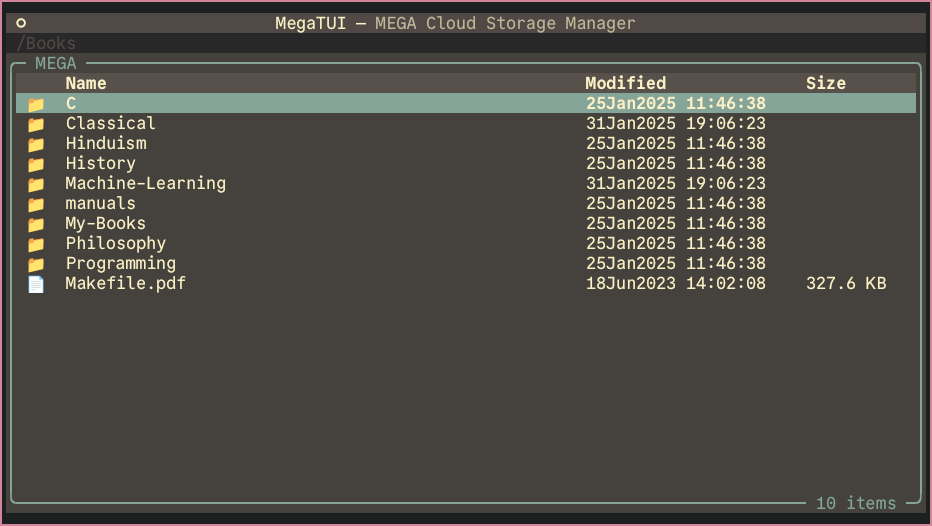
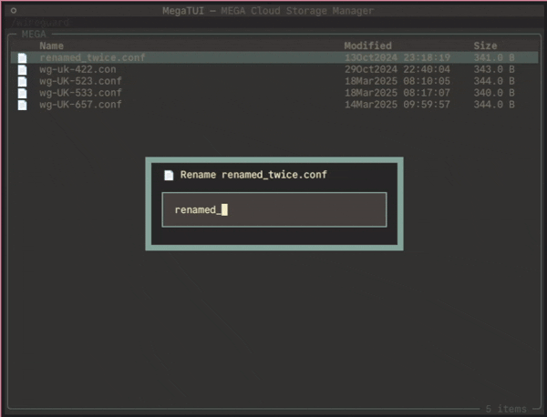
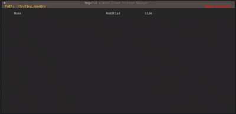

# MegaTUI - Terminal User Interface for MEGA

---

**THIS IS A WORK IN PROGRESS!**

Navigate and manage your MEGA cloud storage directly from the comfort of your
terminal! MegaTUI provides an intuitive text-based user interface (TUI)
powered by the excellent [Textual](https://github.com/Textualize/textual)
framework.

It interacts with your MEGA account by leveraging the official
[MEGAcmd](https://github.com/meganz/MEGAcmd) command-line tools in the
background.

The UI and bindings are inspired by [ranger](https://github.com/ranger/ranger) and
[lf](https://github.com/gokcehan/lf).

## Showcase

### Renaming a file

### Making new directories

## 🪷 Features

As of writing this (_2025-11-04_), work is still ongoing and active.

### Implemented

- **File Navigation:** Navigate through your MEGA cloud drive using intuitive keybindings (press <kbd>f1</kbd> to view currently active bindings).
- **Operate On Files:**
  - Download files
  - Delete files (and folders)
  - Create new directories
  - Upload files
  - Move files around
  - Rename files
  - View media information (frames per second, playtime, resolution).
- **View ongoing transfers**
- **Marking (Selecting) Files For Bulk Operations:** Marking files will allow certain operations to operate on all of them.
  - For example, if you mark 3 files, the move command will move all 3 marked files.
- **Login Check:** Verifies your MEGAcmd login status on startup.

## ⚙️ Installation (Development Only)

**These instructions are for development purposes only. The package is not even in alpha!**

Before you begin, ensure you have the following installed:

1.  **Python:** Version 3.13 is what is currently being used (subject to change potentially).
2.  **MEGAcmd:** The official MEGA command-line tool.
    - Download and install it from the [official MEGAcmd GitHub releases page](https://github.com/meganz/MEGAcmd/releases).
    - **Crucially:** You need to **log in** to your MEGA account using `MEGAcmd`
      _before_ running MegaTUI.
      - Open your terminal and run `mega-login your-email@example.com` and follow the prompts.
        You can verify your login status with `mega-whoami`.
      - MegaTUI currently relies on an existing MEGAcmd session.
    - Run `mega-cmd-server` as a daemon process in the background (speed of
      command execution will be severely reduced otherwise).

3.  **(Recommended)** Install `uv` for package and virtual environment management.
4.  `git clone https://github.com/yaaama/megatui.git && cd megatui`
5.  `uv sync`
6.  To run the project: `uv run /path/to/main.py`

## 📄 License

This project is licensed under the GPL 3.0 License - see the [LICENSE](LICENSE) file for details.

## 🙏 Acknowledgements

- [Textual](https://github.com/Textualize/textual) for the awesome TUI framework.
- [MEGA](https://mega.nz/) and the developers for their tools!
